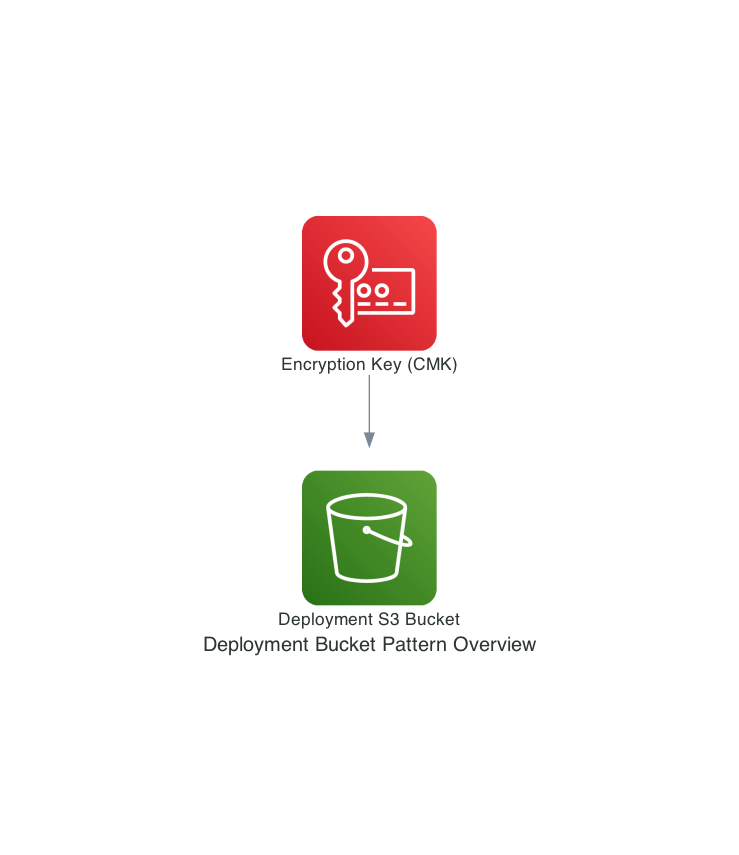

# onp.base.template

## Metadata
| attribute               | value                                         |
| ----------------------- | --------------------------------------------- |
| pattern-id              | onp.base.template                             |
| pattern-name            | base template                                 |
| pattern-version         | 1.0.0                                         |
| pattern-description     | Some description here                         |
| organisation-id         | nc                                            |
| pattern-categories      | bootstrap                                     |

## What is this pattern?
This pattern is a basic template, modify it as you see fit

## What are the use cases?
This pattern is a basic template, modify it as you see fit

## Variables

| Variable               | Source                                         | Value |
| -----------------------| --------------------------------------------- | ------|
| Var1                   | SSM Parameter | onp/bootstrap/base-template|